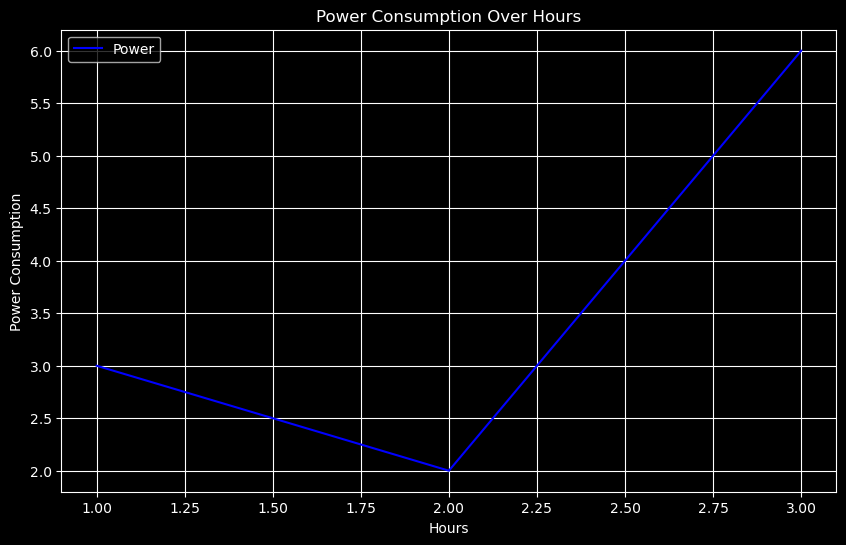

WATTSMART WIZARD : YOUR ENERGY EFFICIENT ALLY 💡

This repository contains scripts and notebooks for retrieving, processing, and analyzing energy consumption data collected from an ESP32 microcontroller connected to AC current and voltage sensors. The data is visualized and analyzed to provide insights and recommendations for optimizing energy usage.

- *Repository Contents* -

retrieve.py: Script for retrieving real-time data from the Blynk platform using the Blynk API.

pinvalues.json: JSON file storing pin values and other configuration data necessary for data retrieval and processing.

process.ipynb: Jupyter notebook for processing and analyzing the retrieved data. This notebook uses Pandas for data manipulation and Matplotlib for visualization.

recommend.py: Script for generating recommendations based on the analyzed data, aimed at optimizing energy consumption.

- *Description* -

retrieve.py ⚡

The retrieve.py script fetches real-time data from the Blynk platform using HTTP GET requests. The script retrieves voltage and current readings from the ESP32 microcontroller and stores them in a structured format for further processing.

pin_values.json

The pinvalues.json file contains configuration data, including the virtual pin assignments for the sensors. This file is essential for the retrieve.py script to correctly map and interpret the sensor data.

process.ipynb 🔌

The process.ipynb notebook is designed for data analysis and visualization. It performs the following functions:

Reads the retrieved data.
Processes the data using Pandas to calculate power consumption and other metrics.
Visualizes the data with Matplotlib to identify trends and patterns in energy usage.

recommend.py 🔋

The recommend.py script generates actionable recommendations based on the processed data. It analyzes energy consumption patterns and suggests ways to optimize energy usage, such as turning off appliances during peak hours or adjusting thermostat settings.

- *Example Observed Trends* 🚀

*Contributing* -
Contributions are welcome! Please fork this repository and submit pull requests for any improvements or additional features.

